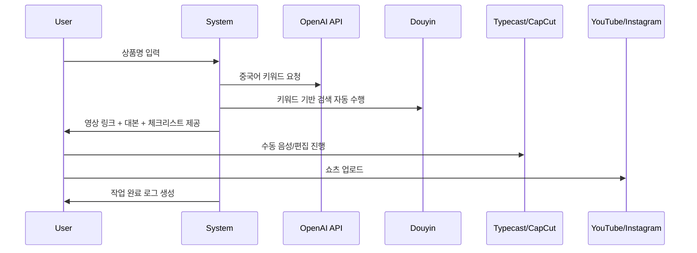

# 📋 쇼핑 쇼츠 자동화 도우미 – 반자동 개발 계획서 (v1.0)

## 1️⃣ 프로젝트 개요

| 항목 | 내용 |
|------|------|
| **프로젝트명** | 쇼핑 쇼츠 자동화 도우미 (Shopping Shorts Assistant) |
| **목표** | 쿠팡 제휴 상품의 쇼츠 콘텐츠 제작 과정 중, **“대본 생성 → 키워드 변환 → Douyin 영상 검색”**까지 자동화 |
| **운영 형태** | 반자동 (AI + 운영자 협업 구조) |
| **주요 자동화 범위** | 상품명 기반 키워드 변환, 릴스 대본 자동 생성, Douyin 영상 자동 검색/링크 추출 |
| **유지보수 난이도** | 초급 수준 (Python + Streamlit) |
| **개발 기간** | 약 2주 (MVP 완성 목표) |

---

## 2️⃣ 자동화 범위 및 프로세스

### 🎯 목표 범위 (자동화 구간)

```mermaid
flowchart TD
A[쿠팡 상품명 입력] --> B[ChatGPT로 중국어 키워드 자동 변환]
B --> C[Douyin 영상 검색 자동 실행 (링크 추출)]
C --> D[운영자 수동: 영상 다운로드, 대본 보정, 음성 제작, 편집]
D --> E[업로드 및 수익화]
```

| 구분 | 처리 주체 | 설명 |
|------|------------|------|
| **1. 상품 입력** | 사용자 | 상품명 또는 쿠팡 URL 입력 |
| **2. 키워드 변환** | AI 자동 | ChatGPT API로 중국어 키워드 생성 |
| **3. Douyin 검색** | AI 자동 | Selenium + yt-dlp로 관련 영상 링크 추출 |
| **4. 영상 다운로드/편집** | 사용자 수동 | 도인로드·CapCut 활용 |
| **5. 업로드/수익 관리** | 사용자 수동 | 유튜브 쇼츠 / 인스타 릴스 |

---

## 3️⃣ 시스템 구조 개요

| 모듈 | 주요 기능 | 담당 기술 |
|------|-------------|-------------|
| `keyword_translator.py` | 상품명 → 중국어 키워드 변환 | OpenAI GPT-4o |
| `douyin_search.py` | Douyin 영상 자동 검색 및 링크 수집 | Selenium + BeautifulSoup |
| `script_generator.py` | 릴스 대본 / 썸네일 문구 자동 생성 | OpenAI GPT-4o |
| `file_manager.py` | 폴더 자동 생성 및 결과 저장 | Python pathlib |
| `checklist_creator.py` | 작업 단계 체크리스트 생성 | Pandas |
| `app/main.py` | Streamlit UI, 입력 및 결과 표시 | Streamlit |

---

## 4️⃣ 개발 단계별 목표 (2주 플랜)

### **Phase 1: 기본 자동화 도우미 구축 (1주차)**

| 일정 | 주요 목표 | 세부 작업 |
|------|------------|-----------|
| Day 1–2 | 환경 설정 | Python 3.10 설치, 가상환경 구성, 패키지 설치 (`openai`, `streamlit`, `selenium`, `pandas`) |
| Day 3–4 | GPT API 연동 | OpenAI API 키 등록 및 대본/키워드 생성 함수 개발 |
| Day 5–6 | Douyin 검색 자동화 | Selenium으로 영상 검색, URL 리스트 추출 기능 구현 |
| Day 7 | Streamlit UI 1차 버전 | 상품명 입력 → 결과 미리보기 (키워드 + 링크 + 대본) |

---

### **Phase 2: 반자동 운영 지원 (2주차)**

| 일정 | 주요 목표 | 세부 작업 |
|------|------------|-----------|
| Day 8–9 | 파일 관리 자동화 | 상품명 기반 폴더 생성 및 자동 저장 구조 완성 |
| Day 10–11 | 체크리스트 모듈 | Pandas로 CSV 형태의 작업 체크리스트 자동 생성 |
| Day 12 | UI 개선 | Streamlit 탭 구성 (대본, 키워드, 링크별 표시) |
| Day 13–14 | 통합 테스트 및 문서화 | 정상/에러 케이스 테스트, README 및 사용자 가이드 작성 |

---

## 5️⃣ 사용자 워크플로우



| 단계 | 입력 | 출력 | 자동화 여부 |
|------|------|-------|-------------|
| ① 상품 입력 | 상품명/쿠팡 URL | 텍스트 | ✅ |
| ② 키워드 변환 | 한국어 명칭 | 중국어 키워드 | ✅ |
| ③ Douyin 검색 | 키워드 | 영상 링크 리스트 | ✅ |
| ④ 대본 생성 | 상품 정보 | 30초 릴스 대본 | ✅ |
| ⑤ 음성/편집 | 대본 | 완성 영상 | ❌ (수동) |
| ⑥ 업로드/분석 | 영상 | 조회수/수익 데이터 | ❌ (수동) |

---

## 6️⃣ 기술 스택 (Phase 1–2 기준)

| 영역 | 기술 | 설명 |
|------|------|------|
| **언어** | Python 3.10+ | 메인 개발 언어 |
| **UI 프레임워크** | Streamlit | 간단한 웹 인터페이스 |
| **AI 엔진** | OpenAI GPT-4o | 대본 + 번역 자동화 |
| **크롤링** | Selenium + BeautifulSoup | Douyin 영상 검색 자동화 |
| **데이터 처리** | Pandas | 체크리스트, CSV 출력 |
| **파일 관리** | pathlib + os | 폴더/파일 자동 정리 |
| **보안** | python-dotenv | API 키 관리 |
| **환경 관리** | Poetry or venv | 패키지 의존성 관리 |

---

## 7️⃣ 결과물 예시 구조

```
project_output/
└── 무선_신발건조기_20251105/
    ├── script.txt               # 자동 생성 릴스 대본
    ├── keywords.txt             # 중국어 키워드
    ├── douyin_links.txt         # 영상 링크 목록
    ├── checklist.csv            # 작업 체크리스트
    ├── metadata.json            # 생성 시각 및 상품 정보
```

---

## 8️⃣ KPI (성과 지표)

| 지표 | 목표 | 측정 방식 |
|------|------|-----------|
| **작업 시간 단축** | 60분 → 35분 | 실제 제작 루틴 비교 |
| **대본 품질 만족도** | 4.0/5.0 이상 | 사용자 피드백 |
| **검색 정확도** | 85% 이상 | Douyin 결과 유효성 |
| **자동화 성공률** | 95% 이상 | 에러 로그 기반 |

---

## 9️⃣ 리스크 및 대응 방안

| 리스크 | 발생 가능성 | 대응 전략 |
|--------|--------------|------------|
| Douyin 구조 변경 | 중 | XPath 및 selector 업데이트 로직 준비 |
| OpenAI 요금 증가 | 중 | 모델 캐싱, GPT-4-turbo로 대체 |
| 네트워크 차단(VPN 필요) | 중 | 수동 VPN 전환 단계 추가 |
| 사용성 피로 | 낮음 | UI 단순화 및 결과 요약 제공 |

---

## 🔟 향후 확장 계획 (v2~v3)

| 버전 | 추가 기능 | 예상 시점 |
|------|-------------|-----------|
| **v2.0** | 음성 자동 생성 (Google TTS) | 2025 Q1 |
| **v3.0** | 영상 자동 합성 (MoviePy) | 2025 Q2 |
| **v4.0** | 자동 업로드 및 트래킹 대시보드 | 2025 Q3 |

---

## ✅ 결론

> 이 시스템은 **“영상 기획의 60%를 AI가, 영상 완성의 40%를 사람이 담당하는 구조”**로 설계됩니다.  
>  
> 자동화된 부분(대본·키워드·영상검색)은 일관성과 효율을 확보하고,  
> 수동 작업(편집·연출)은 크리에이티브 품질을 유지하도록 분리됩니다.  
>  
> 👉 결과적으로 **작업 효율 40~50% 향상**,  
> **품질 유지**, **리스크 최소화**의 균형 모델을 실현합니다.
