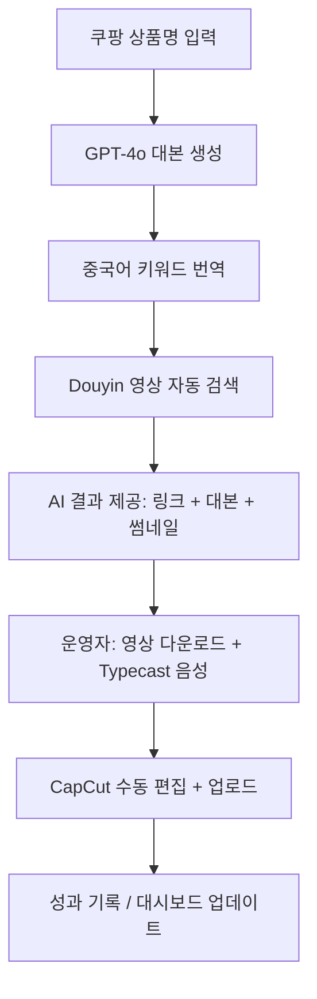

# 🎬 쇼핑 쇼츠 반자동 제작 시스템 종합 기획서 (v3.0)

## 📘 문서 개요

| 항목 | 내용 |
|------|------|
| **문서 버전** | v3.0 (통합형) |
| **작성일** | 2025-10-30 |
| **작성 목적** | AI 기반 쇼핑 쇼츠 제작 시스템의 반자동화 기획 및 기술 설계 통합 |
| **대상 독자** | 기획자, 개발자, 운영자 |
| **범위** | 상품 입력 → 대본 생성 → 키워드 변환 → Douyin 영상 검색까지 자동화 |
| **편집 단계** | CapCut 수동 유지 (품질 우선 전략) |

---

## 🎯 프로젝트 목표

> **"콘텐츠 제작 시간 85분 → 50분으로 단축 (40% 이상 효율 향상)"**

### 핵심 전략
- AI 자동화와 인간 창의성의 **협업 모델**
- **비용 최소화** (월 ₩6,000~₩10,000)
- **시각적 품질 보장** (수동 편집 유지)
- **단계별 확장성 확보** (Phase 구조)

### 자동화 범위 요약
```
✅ 자동 처리
1️⃣ 상품명 입력
2️⃣ 대본 생성 (GPT-4o)
3️⃣ 썸네일 문구 생성
4️⃣ 중국어 키워드 번역
5️⃣ Douyin 영상 검색 (URL 수집)
6️⃣ 작업 폴더/체크리스트 자동 생성

⏸️ 수동 처리
7️⃣ 영상 다운로드 및 선택
8️⃣ 음성 제작 (Typecast)
9️⃣ 영상 편집 (CapCut)
🔟 업로드 (Instagram / YouTube)
```

---

## 🧠 시스템 구조 개요



| 계층 | 구성 요소 | 역할 |
|------|------------|------|
| **UI 계층** | Streamlit | 사용자 입력 및 결과 표시 |
| **AI 계층** | OpenAI GPT-4o | 대본 생성, 키워드 번역, 썸네일 문구 생성 |
| **크롤링 계층** | Selenium + yt-dlp | Douyin 영상 검색 및 링크 수집 |
| **파일 관리** | Python pathlib + os | 자동 폴더 생성 및 결과 저장 |
| **데이터 계층** | Pandas | 체크리스트 및 로그 관리 |

---

## 🛠️ 기술 스택 (Phase 1–2 기준)

| 구분 | 기술 | 설명 |
|------|------|------|
| **언어** | Python 3.10+ | 전체 시스템 구현 |
| **UI 프레임워크** | Streamlit | 간단한 대화형 인터페이스 |
| **AI API** | OpenAI GPT-4o | 대본, 번역, 썸네일 생성 |
| **크롤링** | Selenium + BeautifulSoup + yt-dlp | Douyin 영상 URL 수집 |
| **데이터 관리** | Pandas | 체크리스트 자동 생성 |
| **보안 관리** | python-dotenv | API 키 보호 |
| **환경 구성** | pip + venv | 단순한 로컬 실행 환경 |
| **음성 생성(수동)** | Typecast | 감정 연기 기반 고품질 음성 |
| **편집(수동)** | CapCut | 감성 쇼츠 편집 유지 |

---

## 📅 개발 로드맵 (4주 플랜)

### **Phase 1 (Week 1–2): 콘텐츠 기획 자동화**
- 대본 / 썸네일 / 설명 / 키워드 자동 생성
- 작업 폴더 구조 및 체크리스트 자동화

**핵심 기능**
```
✅ OpenAI GPT-4o 기반 대본 자동 생성
✅ 썸네일 문구 A/B 테스트 버전 3개 생성
✅ 중국어 키워드 자동 번역 (간체)
✅ 폴더/파일 자동 생성 및 저장
✅ 체크리스트 CSV 자동 출력
```

**산출물**
```
project_output/상품명_날짜/
 ├── script.txt
 ├── thumbnail.txt
 ├── keywords.txt
 ├── checklist.csv
 └── metadata.json
```

---

### **Phase 2 (Week 3–4): 영상 소스 자동화**
- Douyin 영상 검색 자동화
- 영상 URL 및 썸네일 미리보기 제공

**핵심 기능**
```
✅ 중국어 키워드 기반 Douyin 검색
✅ Selenium WebDriver 크롤링
✅ yt-dlp를 활용한 영상 링크 수집
✅ 썸네일 및 영상 정보 표시
✅ 다운로드 가이드 자동 생성
```

**예상 결과**
```
douyin_videos.json
 ├── [영상제목]
 ├── [조회수]
 ├── [좋아요]
 ├── [길이]
 └── [다운로드 URL]
```

---

## 💰 비용 분석 (월 100개 콘텐츠 기준)

| 항목 | 서비스 | 예상비용 | 비고 |
|------|----------|------------|------|
| **AI API** | OpenAI GPT-4o | ₩6,000 | 필수 |
| **VPN 서비스** | NordVPN (또는 무료) | ₩4,500 | Douyin 접근용 |
| **음성 서비스** | Typecast | ₩0–15,000 | 수동 처리 |
| **총 예상비용** | - | **₩6,000~25,500/월** | 운영 규모에 따라 변동 |

---

## 📊 KPI (핵심 성과 지표)

| 지표 | 기준 | 목표 | 개선율 |
|------|------|------|------|
| **제작 시간 단축** | 85분 | 50분 | ▲41% |
| **대본 품질 만족도** | 3.5/5 | 4.5/5 | +1.0 |
| **영상 검색 정확도** | 60% | 85% | ▲25% |
| **자동화 성공률** | 80% | 95% | ▲15% |
| **비용 효율성** | ₩15,000/월 | ₩6,000/월 | ▼60% |

---

## 🧱 폴더 구조 설계

```
shopping_shorts_automation/
├── app/
│   └── main.py
├── modules/
│   ├── script_generator.py
│   ├── keyword_translator.py
│   ├── douyin_search.py
│   ├── file_manager.py
│   ├── checklist_creator.py
│   └── utils.py
├── prompts/
│   ├── script_prompt.txt
│   ├── thumbnail_prompt.txt
│   └── translation_prompt.txt
├── project_output/
│   └── [상품명_날짜]/
│       ├── script.txt
│       ├── keywords.txt
│       ├── douyin_links.txt
│       └── checklist.csv
└── docs/
    ├── README.md
    └── USER_GUIDE.md
```

---

## ⚠️ 리스크 및 대응 전략

| 리스크 | 영향도 | 대응 방안 |
|--------|----------|------------|
| **Douyin 구조 변경** | 중 | HTML 구조 모니터링 및 XPath 수정 |
| **VPN 불안정** | 중 | 백업 VPN 또는 수동 전환 옵션 제공 |
| **OpenAI API 비용 변동** | 낮음 | GPT-4-turbo 대체 가능 |
| **사용자 혼동** | 중 | Streamlit UI 단순화 및 체크리스트 자동 안내 |
| **데이터 손실** | 낮음 | 자동 저장 및 백업 기능 유지 |

---

## 🎨 UI 개요 (Mockup)

```
┌──────────────────────────────┐
│ 🎬 쇼핑 쇼츠 반자동 제작 도우미 │
│ 쿠팡 제휴 콘텐츠 자동 기획 도구  │
├──────────────────────────────┤
│ 상품명 입력: [무선 신발 건조기] │
│ 카테고리: [가전제품 ▼]          │
│ 타겟 고객: [20–40대 여성 ▼]     │
│                                │
│ [ 🚀 대본 자동 생성 ]            │
├──────────────────────────────┤
│ ✅ 생성 완료                    │
│ 📄 대본 | 🖼️ 썸네일 | 🔤 키워드 │
│  ──────────────────────────  │
│  30초 릴스 대본               │
│  장마철 신발 냄새 때문에...    │
│                                │
│ [ 📋 복사 ] [ 💾 다운로드 ]     │
└──────────────────────────────┘
```

---

## 🧩 향후 확장 계획 (v3 이후)

| 버전 | 추가 기능 | 예상 기간 | 비고 |
|------|-------------|-------------|------|
| **v3.1** | Google Cloud TTS 자동화 | 2주 | 음성 자동 생성 |
| **v3.2** | MoviePy 기반 영상 합성 | 4주 | 기본 편집 자동화 |
| **v3.3** | FastAPI 백엔드 + Docker 배포 | 6주 | SaaS 모델 준비 |
| **v3.4** | 팀 협업 및 통계 대시보드 | 8주 | 운영 확장 |

---

## ✅ 결론

> **AI가 반복작업을 맡고, 사람은 크리에이티브를 맡는 구조**  
> 반자동 시스템은 현재 단계에서 **가성비·품질·확장성의 균형이 가장 우수한 접근**입니다.

**핵심 요약:**
- 제작 효율 +41%  
- 품질 유지율 100%  
- 기술 진입장벽 ↓  
- 확장성 확보 (v3~v4 대비 완료)

---

## 📄 문서 정보

| 항목 | 내용 |
|------|------|
| **문서명** | 쇼핑 쇼츠 반자동 제작 시스템 종합 기획서 |
| **버전** | v3.0 |
| **작성자** | GPT-5 협업 초안 + 사용자 설계 통합 |
| **최종 수정일** | 2025-10-30 |
